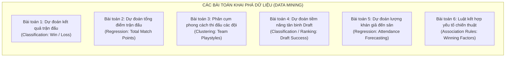

# MỤC TIÊU XÂY DỰNG MÔ HÌNH VÀ BÀI TOÁN PHÂN TÍCH CHO BỘ DỮ LIỆU NBA

Tài liệu này đóng vai trò trả lời cho câu hỏi trọng tâm của đồ án:  
**"Xây dựng kho dữ liệu này để làm gì? Phục vụ ai? Trả lời những bài toán thực tiễn nào trong quản lý, huấn luyện và thương mại thể thao?"**

---

## 1. MỤC TIÊU KINH DOANH & PHÂN TÍCH (BUSINESS / ANALYTICS GOALS)

Trong ngành phân tích thể thao hiện đại (**Sports Analytics**), dữ liệu lớn được sử dụng bởi 3 nhóm đối tượng chính:
1. **Ban huấn luyện & Chuyên gia phân tích (Coaching Staff & Analysts):** 
   - Đánh giá chiến thuật, phân tích điểm mạnh/yếu của đối thủ.
   - Tìm kiếm nguyên nhân dẫn đến chiến thắng (hiệu suất ném rổ, kiểm soát bóng, sức mạnh khu vực cận rổ, phòng ngự phản công nhanh).
2. **Ban quản trị & Tuyển trạch viên (Front Office & Scouts):**
   - Đánh giá tiềm năng cầu thủ tân binh dựa trên chỉ số đo lường thể chất (Draft Combine) và lịch sử Draft để tối ưu hóa chiến lược tuyển quân.
3. **Bộ phận kinh doanh & Truyền thông (Commercial & Media):**
   - Phân tích các yếu tố tác động đến lượng khán giả đến sân (sức chứa sân, phong độ đội bóng, các trận kình địch kịch tính) để tối ưu doanh thu bán vé và bản quyền phát sóng.

---

## 2. DANH MỤC CÁC CÂU HỎI PHÂN TÍCH ĐA CHIỀU (OLAP QUERIES)

Mô hình Star Schema xoay quanh bảng Fact `fact_team_game` kết hợp cùng các chiều `dim_team`, `dim_date`, `dim_season`, `dim_arena` cho phép thực hiện đầy đủ các thao tác OLAP: **Roll-up (cuộn gộp)**, **Drill-down (khoan sâu)**, **Slice & Dice (cắt lát)**, và **Pivot (xoay chiều)**.

### Nhóm A: Phân tích Hiệu suất Chiến thuật & Phong độ (Tactical & Performance)
1. **Tỷ lệ thắng sân nhà vs sân khách (Home Advantage):**
   * *Câu hỏi:* Lợi thế sân nhà (`is_home = 1`) đem lại mức tăng trung bình bao nhiêu % tỷ lệ thắng cho các đội bóng qua từng kỷ nguyên (`era_name`)?
2. **Xu hướng ném 3 điểm (The 3-Point Revolution):**
   * *Câu hỏi:* Tỷ lệ thử sức ném 3 (`fg3a / fga`) và tỷ lệ ném trúng (`fg3_pct`) thay đổi như thế nào từ thời kỳ 1980 đến nay qua từng mùa giải (`season_display`)?
3. **Phân tích hiệu quả ghi điểm tình huống:**
   * *Câu hỏi:* Các đội có điểm trong khu vực cận rổ (`pts_paint`) cao hơn đối thủ có tỷ lệ thắng chung cuộc cao hơn bao nhiêu % so với các đội chủ yếu dựa vào phản công nhanh (`pts_fast_break`)?
4. **Phân tích điểm số theo hiệp đấu (Quarter Breakdown):**
   * *Câu hỏi:* Đội bóng nào có chỉ số bùng nổ điểm số tốt nhất ở Hiệp 4 (`pts_q4`)? Liệu việc dẫn điểm sau Hiệp 3 có đảm bảo >85% chiến thắng chung cuộc?
5. **Mối quan hệ giữa Kiểm soát bóng (Turnover) và Thất bại:**
   * *Câu hỏi:* Tỷ lệ mất bóng trung bình (`tov`) trong các trận thua cao hơn bao nhiêu so với các trận thắng của từng đội?

### Nhóm B: Phân tích Phân cấp Giải đấu (Hierarchical League Analysis)
6. **So sánh sức mạnh giữa 2 miền (Eastern vs Western Conference):**
   * *Câu hỏi:* Miền nào có tỷ lệ thắng đối đầu liên hội (Inter-conference) cao hơn trong 10 mùa giải gần nhất?
7. **Xếp hạng Phân khu (Division Dominance):**
   * *Câu hỏi:* Phân khu (Division) nào sở hữu chỉ số hiệu số điểm trung bình (`plus_minus`) cao nhất toàn giải trong mùa giải Regular Season?
8. **Thành tích đối đầu kình địch (Rivalry Head-to-Head):**
   * *Câu hỏi:* Thành tích đối đầu lịch sử giữa Los Angeles Lakers và Boston Celtics (hoặc Golden State Warriors vs Cleveland Cavaliers) qua các giai đoạn Playoffs.

### Nhóm C: Phân tích Kinh doanh & Vận hành Sân vận động (Commercial & Arena Analytics)
9. **Tỷ lệ lấp đầy nhà thi đấu (Arena Capacity Utilization):**
   * *Câu hỏi:* Sân thi đấu (`dim_arena`) nào đạt tỷ lệ lấp đầy (`attendance / arena_capacity`) cao nhất trong các mùa giải thường?
10. **Tác động của phong độ đối thủ đến lượng vé bán ra:**
    * *Câu hỏi:* Lượng khán giả có xu hướng tăng vọt bao nhiêu % khi đội chủ nhà tiếp đón các đội thuộc Top 4 bảng xếp hạng?
11. **Thời gian thi đấu và lượng khán giả:**
    * *Câu hỏi:* Các trận đấu diễn ra vào cuối tuần (`is_weekend = True` trong `dim_date`) có lượng khán giả trung bình chênh lệch thế nào so với ngày thường trong tuần?

### Nhóm D: Phân tích Cầu thủ & Tuyển trạch (Player & Draft Analytics)
12. **Nguồn cung cấp cầu thủ chất lượng cao:**
    * *Câu hỏi:* Trường đại học nào (College/University) đào tạo ra số lượng cầu thủ lọt vào vòng 1 (Round 1) của kỳ Draft nhiều nhất trong 20 năm qua?
13. **Tỷ lệ sống sót trong giải đấu theo vị trí thi đấu:**
    * *Câu hỏi:* Vị trí thi đấu nào (Guard, Forward, Center) có thời gian thi đấu trung bình (`to_year - from_year`) tại NBA dài nhất?
14. **Phân tích quốc tế hóa của giải đấu:**
    * *Câu hỏi:* Tỷ lệ các cầu thủ sinh ra ngoài nước Mỹ (`country != 'USA'`) đã tăng trưởng như thế nào qua các thập kỷ?

---

## 3. CÁC BÀI TOÁN KHAI PHÁ DỮ LIỆU & MACHINE LEARNING (DATA MINING SCENARIOS)

Việc tích hợp dữ liệu sạch vào Kho dữ liệu sẽ tạo nền tảng vững chắc (Feature Store) để giải quyết các bài toán Data Mining sau:

### 1. Phân loại: Dự đoán Kết quả Trận đấu (Match Outcome Prediction)
* **Loại bài toán:** Binary Classification (`1 = Win`, `0 = Loss`).
* **Input Features:** 
  - Phong độ 5 trận gần nhất của Đội Nhà và Đội Khách (Rolling Averages: PPG, Win Rate, FG%, Reb).
  - Yếu tố sân nhà (`is_home = 1`).
  - Lịch sử đối đầu trực tiếp giữa 2 đội (Head-to-head win rate).
  - Ngày nghỉ ngơi (Rest days) giữa các trận đấu.
* **Mô hình áp dụng:** Logistic Regression, Random Forest, XGBoost, LightGBM.
* **Ý nghĩa thực tiễn:** Ứng dụng trong dự đoán thể thao, hỗ trợ ban huấn luyện đưa ra điều chỉnh chiến thuật trước trận.

### 2. Hồi quy: Dự đoán Tổng điểm trận đấu / Điểm số của Đội (Score Forecasting)
* **Loại bài toán:** Regression (`Target: pts`).
* **Input Features:** Tốc độ trận đấu (Pace ước tính từ FGA + TOV), hiệu suất ném 3 điểm gần đây, điểm thủng lưới trung bình của đối thủ.
* **Mô hình áp dụng:** Ridge/Lasso Regression, Gradient Boosting Regressor.
* **Ý nghĩa thực tiễn:** Phục vụ định lượng sức mạnh tấn công và đánh giá khả năng bùng nổ điểm số của từng đội bóng.

### 3. Phân cụm: Nhận diện Phong cách Thi đấu của các Đội bóng (Team Playstyle Clustering)
* **Loại bài toán:** Unsupervised Clustering.
* **Features đầu vào:**
  - Tỷ lệ điểm cận rổ (`pts_paint / pts`)
  - Tỷ lệ điểm ném 3 (`fg3m * 3 / pts`)
  - Tỷ lệ điểm phản công nhanh (`pts_fast_break / pts`)
  - Tỷ lệ kiến tạo (`ast / fgm`)
* **Thuật toán:** K-Means, Hierarchical Clustering (Dendrogram), PCA để trực quan hóa.
* **Kết quả kỳ vọng:** Phân loại các đội vào các trường phái:
  - *Nhóm "Small-Ball / Perimeter":* Tập trung ném 3, kéo giãn sân, tốc độ cao.
  - *Nhóm "Inside Dominance":* Tập trung cận rổ, tranh chấp bóng bật bảng (Rebound).
  - *Nhóm "Fast-Break Transition":* Phòng ngự phản công nhanh.
  - *Nhóm "Balanced Playmakers":* Lối chơi đồng đội, nhiều kiến tạo.

### 4. Phân loại & Xếp hạng: Dự đoán Tiềm năng Thành công của Cầu thủ Draft (Draft Success Prediction)
* **Loại bài toán:** Binary Classification (`1 = Ngôi sao / Trụ cột`, `0 = Dự bị / Bị đào thải`).
* **Features đầu vào:**
  - Các chỉ số đo lường tại Draft Combine (`wingspan`, `height_wo_shoes`, `max_vertical_leap`, `bench_press`, `lane_agility_time`).
  - Vị trí thi đấu (`position`), trường đại học, độ tuổi khi được chọn.
* **Mô hình áp dụng:** Decision Trees, Random Forest, SVM.
* **Ý nghĩa thực tiễn:** Giúp các tuyển trạch viên (Scouts) hạn chế rủi ro chọn nhầm những tân binh gây thất vọng (Draft Bust).

### 5. Hồi quy: Dự báo Lượng khán giả đến sân (Stadium Attendance Forecasting)
* **Loại bài toán:** Regression (`Target: attendance`).
* **Features đầu vào:** 
  - Đội chủ nhà, Đội khách (các đội có siêu sao thường kéo khán giả đông hơn).
  - Ngày trong tuần, tháng, mùa giải, giai đoạn giải đấu (Regular vs Playoffs).
  - Khoảng cách bảng xếp hạng giữa 2 đội.
* **Mô hình áp dụng:** Linear Regression, Random Forest Regressor.
* **Ý nghĩa thực tiễn:** Hỗ trợ phòng kinh doanh tối ưu chiến lược giá vé linh hoạt (Dynamic Pricing) và kế hoạch vận hành sân.

### 6. Khai phá Luật Kết hợp: Các yếu tố chiến thuật thường đi liền với chiến thắng (Association Rules Mining)
* **Loại bài toán:** Association Rules (Apriori / FP-Growth).
* **Mô tả:** Nhị phân hóa các chỉ số thống kê (vd: `High_3PT = True`, `Low_TOV = True`, `High_Paint = True`, `Win = True`).
* **Kết quả kỳ vọng:** Khai phá các luật như:
  - `IF {High_Rebound = True AND High_Paint_Pts = True} THEN {Win = True}` (Support = 25%, Confidence = 78%).
  - Trả lời cho HLV biết: Kết hợp những yếu tố chiến thuật nào sẽ mang lại xác suất thắng cao nhất?

---

## 4. BẢNG TÓM TẮT ĐÁNH GIÁ MỤC TIÊU CHO BÁO CÁO ĐỒ ÁN

| Mục tiêu phân tích | Phương pháp | Dữ liệu chính sử dụng | Đối tượng phục vụ |
|---|---|---|---|
| **Báo cáo Dashboard OLAP** | Star Schema, SQL OLAP, Power BI | `fact_team_game`, các `dim_*` | Lãnh đạo giải, Ban huấn luyện, Truyền thông |
| **Phân loại thắng/thua** | Machine Learning (Classification) | Stats trận đấu, lịch sử đối đầu | Chuyên gia phân tích, Dự đoán thể thao |
| **Phân cụm phong cách đội** | Data Mining (K-Means) | Tỷ lệ điểm chiến thuật, Rebound, Assist | Giám đốc kỹ thuật, Huấn luyện viên |
| **Dự đoán tuyển dụng Draft** | Machine Learning (Ranking/Trees) | `players_merged` (Combine stats + Draft pick) | Ban tuyển trạch (Scouting Team) |
| **Dự báo lượng khán giả** | Time Series / Regression | `fact_team_game` + `dim_arena` + `dim_date` | Phòng vé, Marketing, Quản lý sân |
