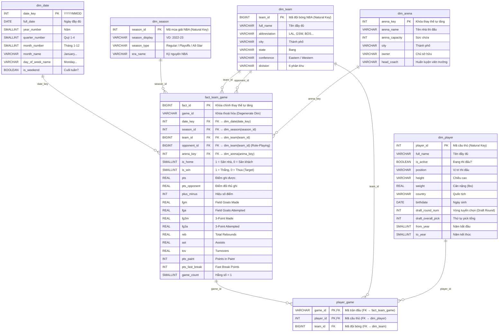
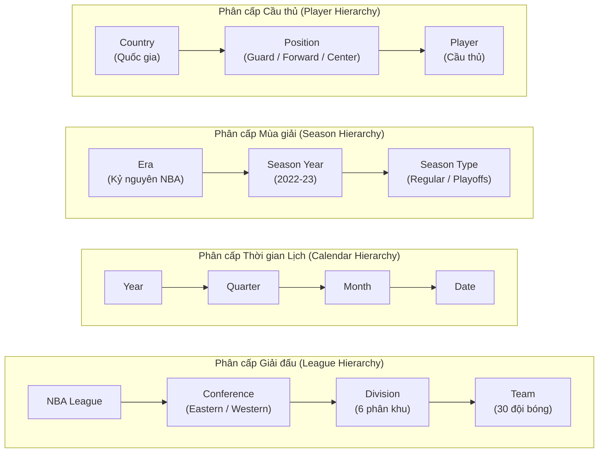

# THIẾT KẾ MÔ HÌNH STAR SCHEMA — NBA DATA WAREHOUSE

## Tổng quan

- **Chủ đề phân tích:** Giám sát & đánh giá hiệu suất thi đấu các đội bóng NBA qua các mùa giải và theo dõi sự hiện diện của cầu thủ trong từng trận đấu.
- **Phương pháp luận:** Ralph Kimball — Dimensional Modeling (Star Schema kết hợp Bridge Table).
- **Hạt dữ liệu (Grain):** 
  - Bảng Fact `fact_team_game`: Mỗi dòng = hiệu suất thi đấu của **1 đội bóng** trong **1 trận đấu**.
  - Bảng Bridge `player_game`: Mỗi dòng = **1 cầu thủ** tham gia thi đấu cho **1 đội bóng** trong **1 trận đấu**.
- **Nguồn dữ liệu đã tiền xử lý (`dataset/processed/`):**
  - `games_merged.csv` (65,642 trận)
  - `teams_merged.csv` (30 đội)
  - `players_merged.csv` (4,831 cầu thủ)
  - `player_game.csv` (617,110 liên kết cầu thủ ↔ trận đấu)

> [!IMPORTANT]
> Một trận đấu giữa 2 đội sẽ được **unpivot** thành **2 dòng** trong bảng Fact `fact_team_game` (1 dòng cho Đội Nhà, 1 dòng cho Đội Khách), tổng cộng khoảng **~131,284 bản ghi Fact**.
> Khóa chính của `dim_season` (`season_id`) và `dim_team` (`team_id`), `dim_player` (`player_id`) sử dụng **Natural Key** trực tiếp từ nguồn do dữ liệu đã được kiểm tra 100% không trùng lặp (0 duplicate), không null và có tính ổn định cao.

---

## Sơ đồ Star Schema (ERD)

---

## Cây phân cấp đa chiều (Drill-Down Hierarchies)

---

## Ánh xạ dữ liệu nguồn (Source-to-Target Mapping)

### 1. Bảng Fact `fact_team_game` ← `games_merged.csv`

| Cột nguồn (CSV) | Cột đích (Fact) | Ghi chú |
|---|---|---|
| `game_id` | `game_id` | Degenerate Dimension |
| `game_date` | → Tra cứu `date_key` | Chuyển đổi thành định dạng `YYYYMMDD` |
| `season_id` | `season_id` | Foreign Key trỏ trực tiếp `dim_season(season_id)` |
| `team_id_home` / `team_id_away` | `team_id` | Unpivot 2 dòng, FK → `dim_team(team_id)` |
| Đội đối diện | `opponent_id` | Role-Playing FK trỏ sang `dim_team(team_id)` |
| Đội nhà | → Tra cứu `arena_key` | Tra cứu theo sân nhà |
| `wl_home` / `wl_away` | `is_win` | W=1, L=0 |
| Vị thế thi đấu | `is_home` | 1 cho Home row, 0 cho Away row |
| `pts_home` / `pts_away` | `pts` | Điểm số ghi được |
| `plus_minus_home` / `_away` | `plus_minus` | Hiệu số điểm |
| `fgm_home` / `fga_home` | `fgm`, `fga` | Ném rổ trúng / lần thử sức |
| `fg3m_home` / `fg3a_home` | `fg3m`, `fg3a` | Ném 3 điểm trúng / lần thử sức |
| `reb_home`, `ast_home`, `tov_home` | `reb`, `ast`, `tov` | Rebounds, Assists, Turnovers |
| `pts_paint_home`, `pts_fb_home` | `pts_paint`, `pts_fast_break` | Điểm vùng sơn, điểm phản công nhanh |
| Hằng số | `game_count` | Luôn bằng 1 |

### 2. Bảng Bridge `player_game` ← `player_game.csv`

| Cột nguồn (CSV) | Cột đích | Ghi chú |
|---|---|---|
| `game_id` | `game_id` | Khóa chính phức hợp & FK liên kết với `fact_team_game` |
| `player_id` | `player_id` | Khóa chính phức hợp & FK trỏ sang `dim_player` |
| `team_id` | `team_id` | FK trỏ sang `dim_team` (đội mà cầu thủ khoác áo trong trận này) |

### 3. Bảng `dim_player` ← `players_merged.csv`

| Cột nguồn (CSV) | Cột đích | Ghi chú |
|---|---|---|
| `player_id` | `player_id` | Primary Key (Natural Key, 4,831 cầu thủ duy nhất) |
| `full_name` | `full_name` | Họ tên đầy đủ |
| `is_active` | `is_active` | 1 = Đang thi đấu, 0 = Giải nghệ |
| `position` | `position` | Guard, Forward, Center... |
| `height`, `weight` | `height`, `weight` | Chiều cao, cân nặng |
| `country`, `birthdate` | `country`, `birthdate` | Quốc gia, ngày sinh |
| `draft_round_num` | `draft_round_num` | Vòng tuyển chọn tân binh |
| `draft_overall_pick` | `draft_overall_pick` | Lượt chọn tổng thể |
| `from_year`, `to_year` | `from_year`, `to_year` | Năm bắt đầu, năm kết thúc |

### 4. Bảng `dim_team` ← `teams_merged.csv`

| Cột nguồn | Cột đích | Ghi chú |
|---|---|---|
| `team_id` | `team_id` | Primary Key (Natural Key, 30 đội duy nhất) |
| `full_name` | `full_name` | Tên đầy đủ chính thức |
| `abbreviation` | `abbreviation` | Tên viết tắt (LAL, GSW, BOS...) |
| `city`, `state` | `city`, `state` | Thành phố, Bang |
| `conference` | `conference` | Eastern Conference / Western Conference |
| `division` | `division` | 6 phân khu địa lý |

### 5. Bảng `dim_season` ← `games_merged.csv`

| Cột nguồn | Cột đích | Ghi chú |
|---|---|---|
| `season_id` | `season_id` | Primary Key (Natural Key, 225 giá trị duy nhất) |
| Chuỗi hiển thị | `season_display` | Ví dụ: '2022-23' |
| `season_type` | `season_type` | Regular Season / Playoffs / All-Star / Pre Season |
| Phân loại năm | `era_name` | 4 Kỷ nguyên lịch sử NBA |

### 6. Bảng `dim_date` ← Sinh tự động từ dải ngày của `game_date`

### 7. Bảng `dim_arena` ← `teams_merged.csv` (Surrogate Key: `arena_key IDENTITY`)
